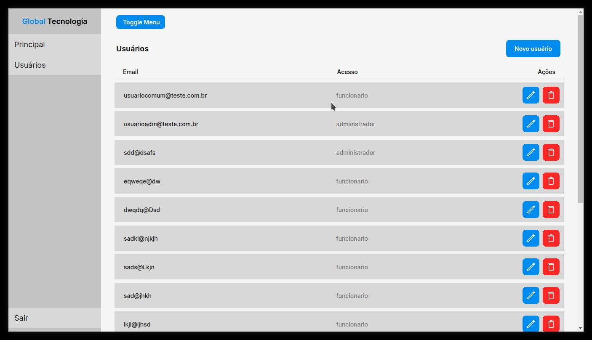

# Front-End do desafio da Global Tecnologia

Sistema de gerenciamento de usuários, exibição de gráficos com dados vindos de uma api externa,
autenticação, rotas privadas com base no usuário.

**Aqui tem o projeto rodando ao vivo: [link]()**



## Passos para reproduzir

Clone o repositório:

```
git clone https://github.com/leonardolima99/desafio-global-react.git
```

Vá até a pasta do projeto e execute um

```
yarn install
```

Depois é só rodar um

```
yarn dev
```

Usuários mocados:

```
  - Administrador
    email: usuarioadm@teste.com.br
    senha: 123456

  - Funcionário
    email: usuariocomum@teste.com.br
    senha: 123456
```
